# LeafBid

## Project Description
LeafBid is a web-based real-time auction platform for rare and collectible plants. It provides a secure, structured marketplace that replaces unreliable social media auctions. LeafBid prevents bidding disputes, eliminates time sync errors, and ensures plant authenticity through an expert verification process. The platform supports live bidding, seller management, and admin verification, creating a trusted environment for plant enthusiasts and sellers.

---

## System Architecture Overview

- **Architecture Style:** Layered Architecture (4 layers)
- **Layers:** Presentation → Application → Domain → Data
- **Communication:** REST APIs + WebSockets (Socket.io)
- **Database:** PostgreSQL

### Why Layered Architecture?
Layered Architecture was chosen over Microservices to simplify deployment, reduce operational overhead, and enable rapid iteration for a small team. This approach provides clear separation of concerns, maintainability, and scalability for the current project size, while allowing future migration to microservices if needed.

### Project Structure
```
LeafBid/
├─ backend/
│  ├─ src/
│  │  ├─ controllers/
│  │  ├─ models/
│  │  ├─ routes/
│  │  ├─ services/
│  │  ├─ middleware/
│  │  ├─ database/
│  │  ├─ socket/
│  │  ├─ scheduler/
│  │  └─ server.js
│  └─ .env.example
└─ frontend/
   └─ src/
      ├─ components/
      ├─ pages/
      ├─ utils/
      └─ App.jsx
```

---

## User Roles & Permissions

| Role | Description | Permissions |
|------|-------------|-------------|
| **Buyer** | Rare plant collector | CREATE bid, READ auctions/profile, UPDATE profile |
| **Seller** | Garden owner / plant seller | CREATE/READ/UPDATE/DELETE plants and auctions |
| **Admin** | Plant expert / moderator | READ/UPDATE plants (verify), READ/UPDATE/DELETE auctions |

---

## Technology Stack

| Layer | Technology |
|-------|------------|
| Frontend | React (Vite), Tailwind CSS |
| Backend | Node.js, Express |
| Real-Time Engine | Socket.io |
| Database | PostgreSQL |
| Authentication | JWT (jsonwebtoken + bcrypt) |
| File Upload | Multer |
| Scheduler | node-cron |
| HTTP Client | Axios |

---

## Installation & Setup

### Prerequisites
- Node.js v18+
- PostgreSQL (database named `leafbid`)

### 1. Clone the repository
```bash
git clone https://github.com/your-username/LeafBid.git
cd LeafBid
```

### 2. Set up the backend
```bash
cd backend
npm install
cp .env.example .env
# Edit .env with your database credentials:
# DB_HOST, DB_PORT, DB_USER, DB_PASSWORD, DB_NAME, JWT_SECRET
# Run schema.sql to initialize tables:
psql -U your_user -d leafbid -f src/database/schema.sql
```

### 3. Set up the frontend
```bash
cd ../frontend
npm install
```

---

## How to Run

### Start the backend
```bash
cd backend
node src/server.js
# Server runs on http://localhost:3000
```

### Start the frontend
```bash
cd frontend
npm run dev
# App runs on http://localhost:5173
```

---

## Screenshots

### Authentication
| Login | Register (with validation) |
|-------|---------------------------|
| 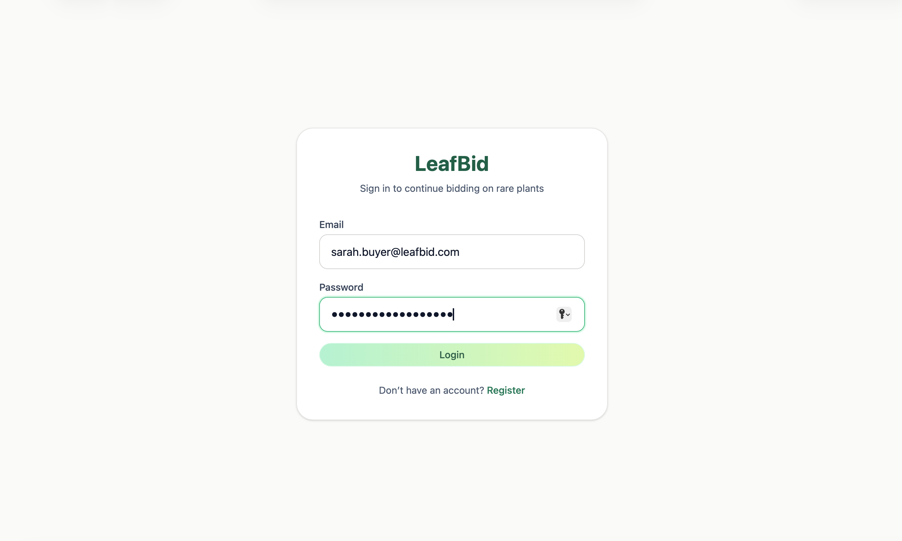 | 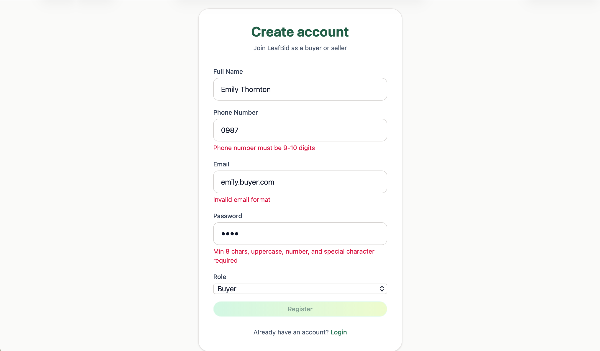 |

### Buyer
| Browse Auctions | Bidding Room |
|-----------------|--------------|
| 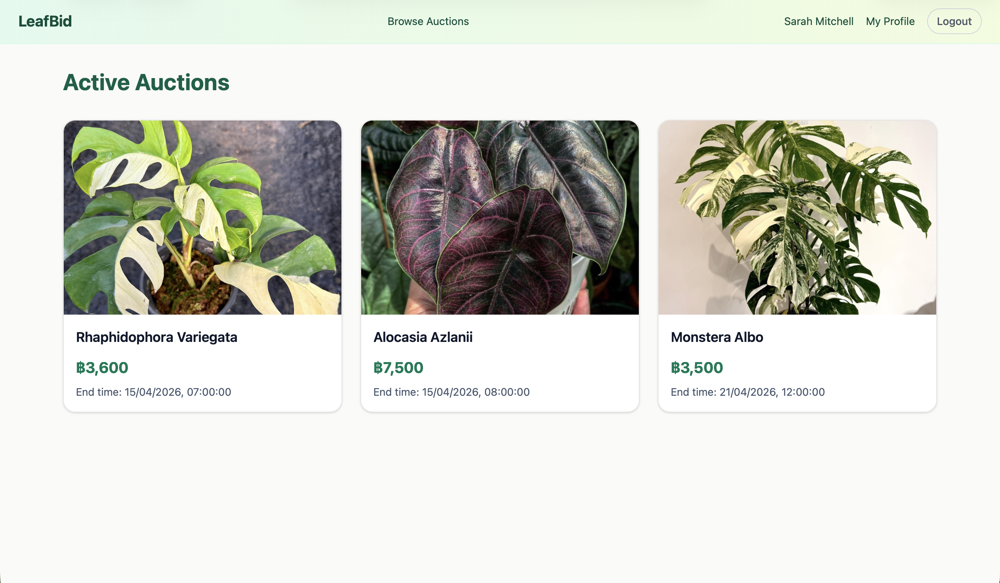 | 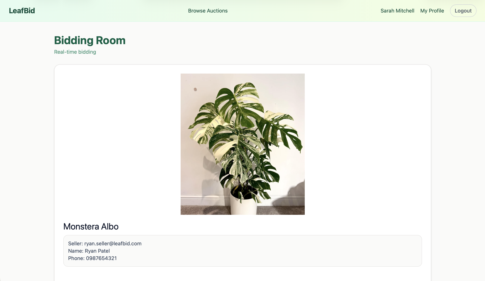 |

| Bidding Room (continue) | Profile & Won Auctions |
|-------------------------|------------------------|
| 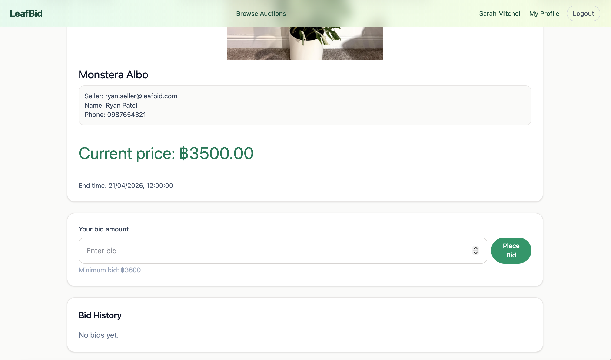 | 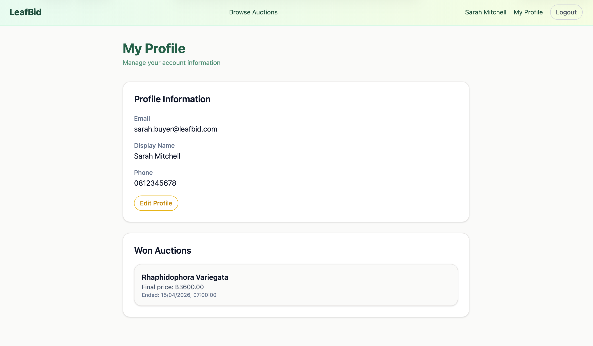 |

### Seller
| Plant Management | Auction Management |
|------------------|--------------------|
| 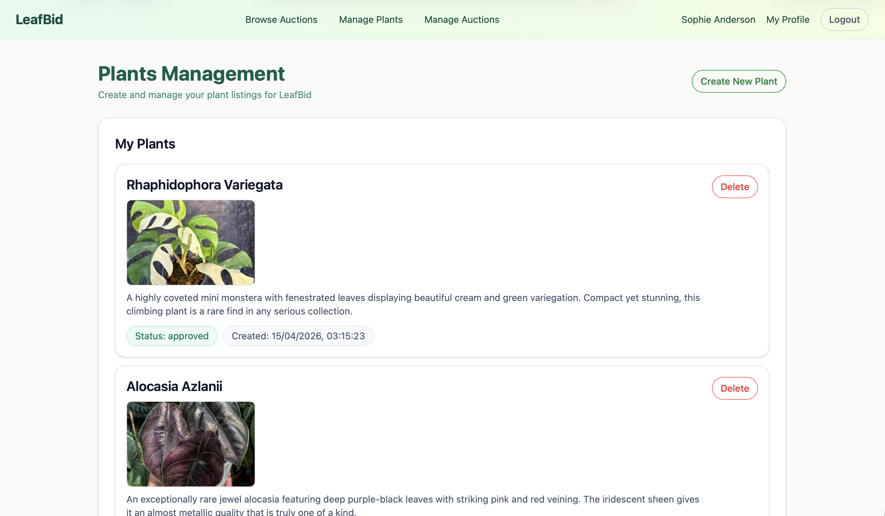 | 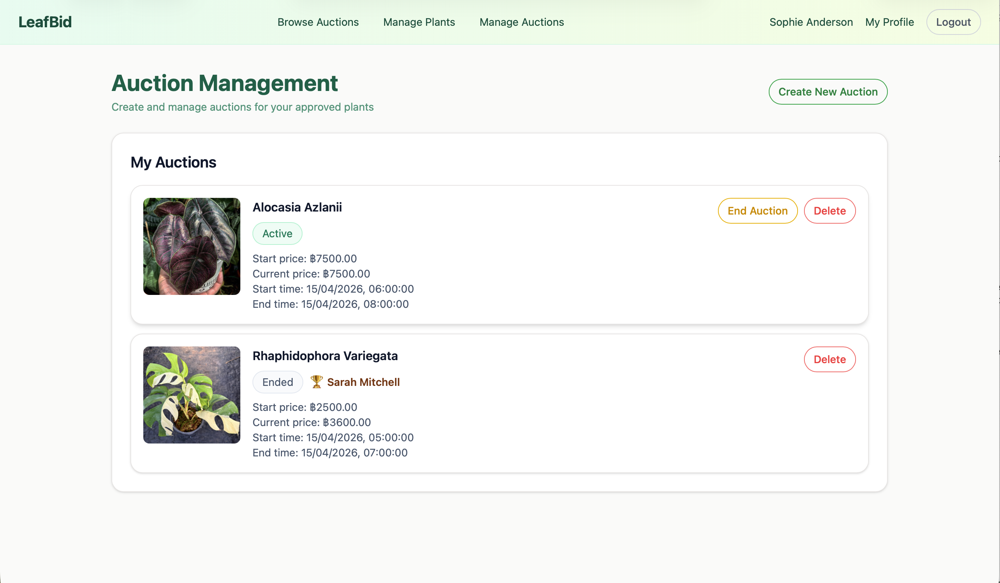 |

| Bidding Room (seller view) | Auction Ended |
|---------------------------|---------------|
| 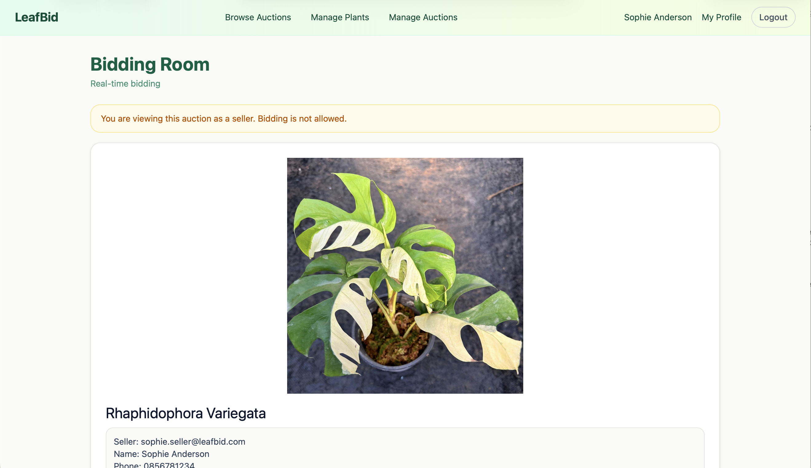 | 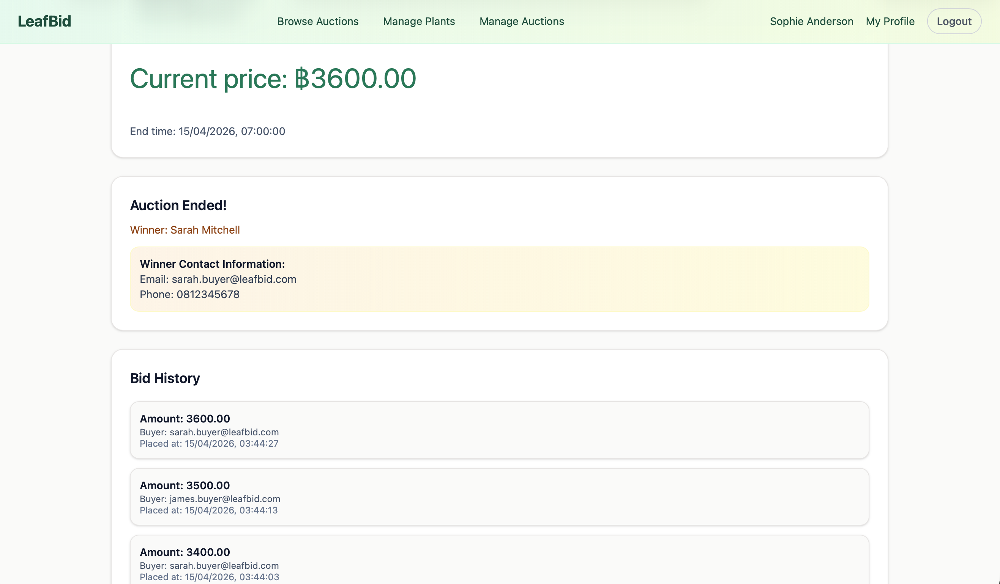 |

### Admin
| Pending Plant Verification | Manage Auctions |
|---------------------------|-----------------|
| 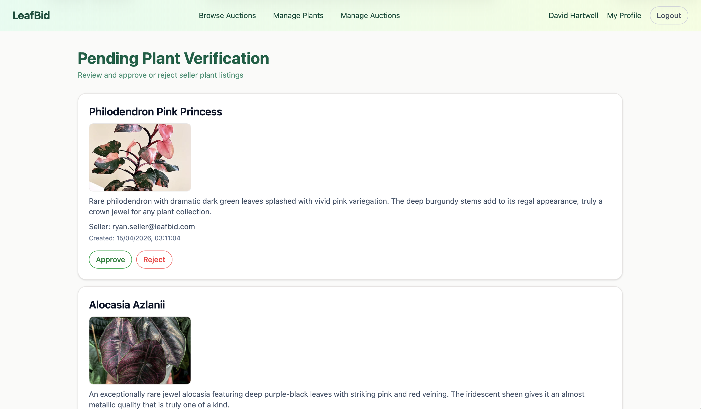 | 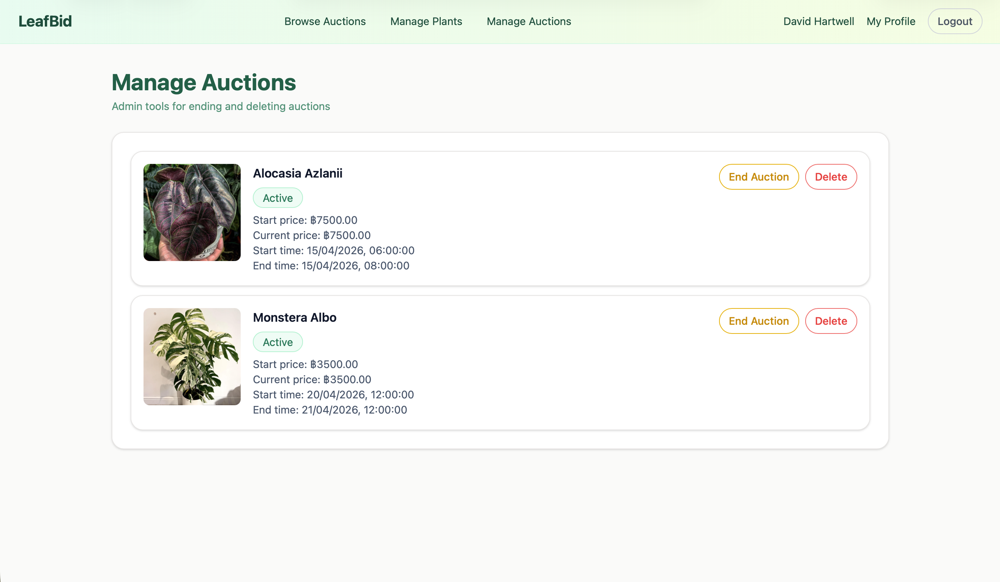 |